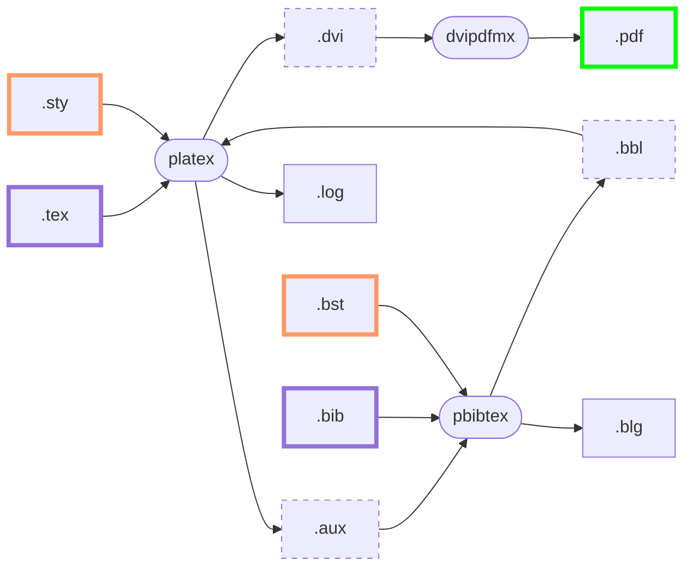

# LaTeX

## pLaTeX + pBibTeX + dvipdfmx

Under Construction.

```shell-session
$ platex main
$ pbibtex main
$ platex main
$ platex main
$ dvipdfmx main
```

```shell-session
$ latexmk
```



- source files
	- `.tex`
	- `.bib`
- template files
	- `.sty`
	- `.bst`
- log files
	- `.log`
	- `.blg`
- temporary files
	- `.aux`
	- `.bbl`
- final output files
	- (`.dvi`)
	- `.pdf`

## pdfTeX + BibTeX

Under Construction.
