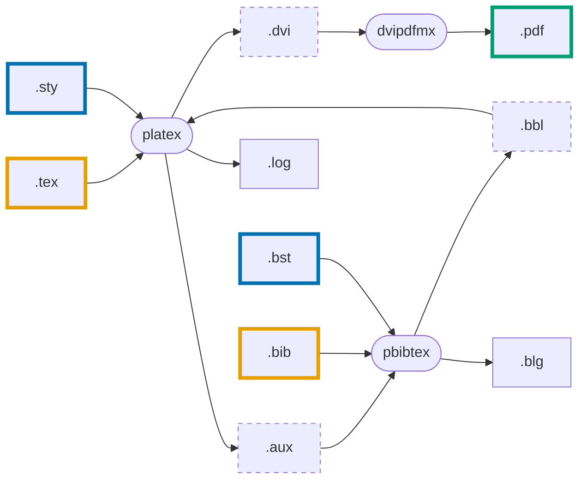

---
tags:
  - Draft
---

# LaTeXの処理系

Under Construction.

日本語文書を処理する場合の例

## pLaTeX + pBibTeX + dvipdfmx

`platex` コマンドは次のように複数回実行する必要がある。

```shell-session
$ platex main
$ pbibtex main
$ platex main
$ platex main
$ dvipdfmx main
```

`latexmk` を使えば複数のコマンドの実行を自動化できる。

次のように `latexmkrc` ファイルを用意しておく。

```.pl title="latexmkrc"
$latex = 'platex';
$bibtex = 'pbibtex';
$dvipdf = 'dvipdfmx %O -o %D %S';
$makeindex = 'mendex %O -o %D %S';
$pdf_mode = 3;
```

次のように `latexmk` コマンドを実行する。

```shell-session
$ latexmk -f main
```

各コマンドと入出力ファイルの関係は次のとおり。




- source files
	- `.tex`
	- `.bib`
- template files
	- `.sty`
	- `.bst`
- log files
	- `.log`
	- `.blg`
- temporary files
	- `.aux`
	- `.bbl`
- final output files
	- (`.dvi`)
	- `.pdf`

## pdfTeX + BibTeX

英語文書を処理する場合の例


